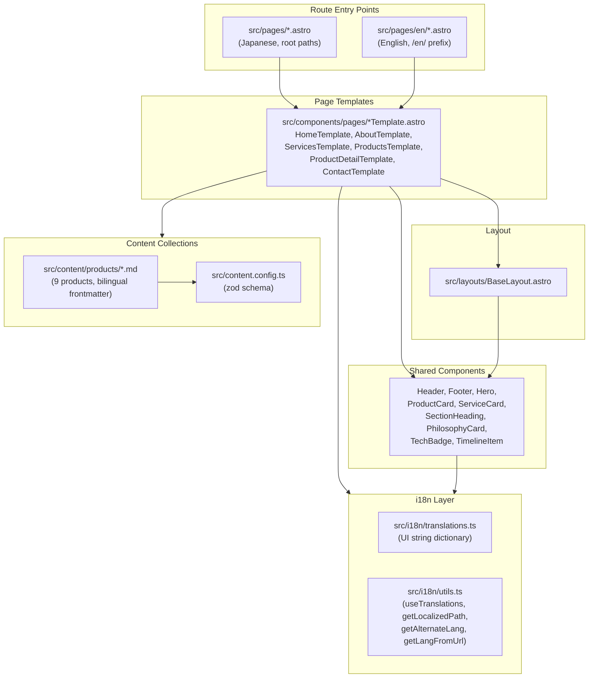
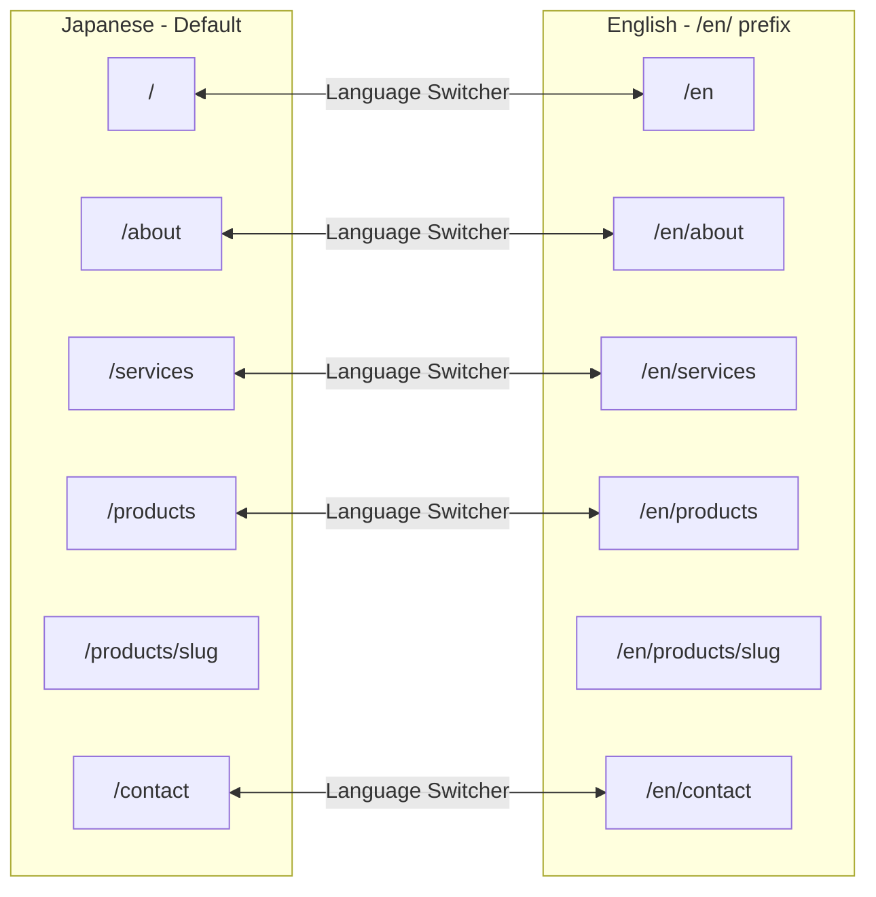
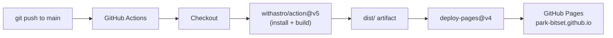

# Architecture

This document describes the high-level architecture of the bitset Inc. company portfolio site.

## System Overview

## Layering

The architecture follows a strict layering principle:

1. **Route entry points** (`src/pages/`) — thin wrappers, no logic
2. **Page templates** (`src/components/pages/`) — all page logic, data fetching, translations
3. **Shared components** (`src/components/`) — reusable, locale-aware UI building blocks
4. **Layout** (`src/layouts/BaseLayout.astro`) — HTML shell, meta tags, Header/Footer
5. **i18n** (`src/i18n/`) — translation dictionary and utility functions
6. **Content** (`src/content/`) — markdown product data validated by zod schema

Templates may import components and i18n utilities. Components may import i18n utilities.
Route entry points only import and render a single template. Nothing imports from route entry points.

## i18n Routing Model

Configured in `astro.config.mjs`:

- `defaultLocale: 'ja'` with `prefixDefaultLocale: false` — Japanese pages have no prefix
- English pages live under `src/pages/en/` and are served at `/en/*`
- `Astro.currentLocale` is used by templates to select the correct language
- The Header component renders a language switcher linking to the alternate locale

## Content Collections

Products are defined as an Astro content collection using markdown files with zod-validated frontmatter.

**Schema fields** (from `src/content.config.ts`):

| Field | Type | Purpose |
|-------|------|---------|
| `title` | string | English product name |
| `titleJa` | string | Japanese product name |
| `description` | string | English description |
| `descriptionJa` | string | Japanese description |
| `category` | enum | pondashi, network-tools, iot-tools, hardware |
| `features` | string[] | English feature list |
| `featuresJa` | string[] | Japanese feature list |
| `specs` | object[]? | English spec label/value pairs |
| `specsJa` | object[]? | Japanese spec label/value pairs |
| `amazonUrl` | string? | Link to Amazon product page |
| `order` | number | Sort order for display |

Templates select the correct language field based on `Astro.currentLocale`.

## Build and Deploy

- Triggered on push to `main` or manual `workflow_dispatch`
- Uses the official `withastro/action@v5` for build
- Deploys via `actions/deploy-pages@v4`
- Configuration in `.github/workflows/deploy.yml`

## Styling

- **Tailwind CSS 4** via `@tailwindcss/vite` plugin
- Custom theme in `src/styles/global.css` using `@theme` directive
- **Primary palette**: Blue scale (primary-50 through primary-950)
- **Accent palette**: Teal scale (accent-50 through accent-900)
- **Fonts**: Inter (Latin), Noto Sans JP (Japanese), loaded from Google Fonts
